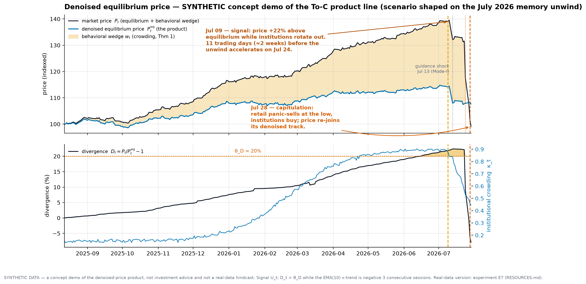
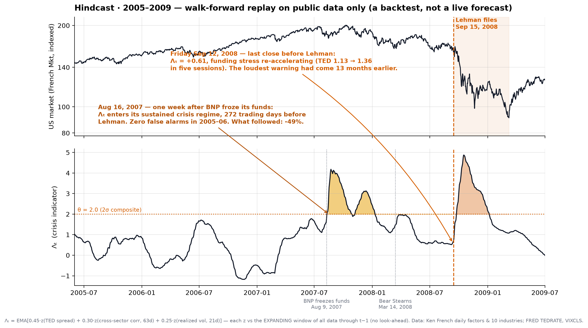

<div align="center">

# MicroWorld
# 世界モデル × クオンツファイナンス

*金融市場のために設計された初の世界モデル・アーキテクチャ*
*従来のファクター・マイニングを超える、クオンツファイナンスの新パラダイム*

**[English](../../README.md) | [中文文档](../../README_CN.md) | [日本語](README_JA.md) | [한국어](README_KO.md)**

**Alpha Flow Research · HongJin HE · HKUST / Stanford IHP · 2026年7月**

</div>

> これは完全版READMEの要約翻訳です。数学的詳細・17日間ノートブック・全実験計画は[英語版](../../README.md)をご覧ください。

---

## MVP — ノイズ除去済み均衡価格の予測

> *価格から行動ノイズを剥がすと、残るのは均衡——すべてのプレイヤーが戦略を出し終えたとき、その資産が本当に持つ価値。**私たちが予測するのはその軌跡だ。** 明日のティックではなく、ミリ秒ではなく月単位で保有する人のための、ノイズ除去済み価格。*

[](../../demo/denoised_price_2026.py)

**1コマンド、APIキー不要：** `python demo/denoised_price_2026.py` — 2026年7月のメモリ半導体セクター崩落（SOX指数が単月−19%、2008年以来最悪）を情景原型とする**合成データ**のコンセプトデモ：

- **青線がプロダクト**——世界モデルが解く均衡トラック P^eq。**黒線が市場**——均衡＋行動のくさび（機関投資家の過密と、LLMに同質化された個人投資家の追随で膨張する）
- **シグナル**——乖離 D_t = P_t/P^eq_t − 1 が閾値を超え、*かつ機関の平均場が撤退中*——は崩落加速の**11営業日（約2週間）前**に点灯。個人投資家は底値で投げ売り、機関が同じ底値で拾い、価格はノイズ除去済みトラックへ回帰する
- **対象：** 中長期保有者（To-C・個人投資家）。デイトレード・高頻度取引は意図的に**対象外**——その周波数では行動ノイズが支配的で、定理1（双対クラメール・ラオ限界）がデータ量では克服不可能なことを証明している。週〜月のスケールでは均衡成分が支配的——本モデルはまさにそこで戦うよう設計されている。*（研究シグナルであり投資助言ではない。実データ版は実験E7。）*

**なぜこれが可能なのか？** 中身に特徴量エンジニアリングもファクター・マイニングも一切ないからだ。これは**市場のプレイヤーの世界モデル**：機関と個人投資家コホートが相互作用する4層全結合ネットワーク——*今日*は階層的平均場ゲームとして解き（第1段階：データ希少時代の正しい形態）、*明日*は**各ニューロン自体が小さなニューラルネットワーク**であるネットワークとして直接訓練する（第2段階：[NNGS](../PHASE2_NEURAL_GAME.md)、H200級計算資源待ち）。価格はデータへの当てはめではなく**ゲームから導出**されるため、予測の一歩一歩が**因果的に帰属可能**——どの主体、どの制約、どの結合か。

## プロジェクトの物語

なぜすべてのトレーディングモデルは、本番投入の瞬間から死に始めるのか？答えはより良いデータでも、より大きなネットワークでもない。**市場はデータセットではなく、ゲームである。** パターンを予測すれば、パターンは消える。モデル化できる残りのものは、プレイヤー自身だけだ。

MicroWorldは、米国株式市場を**4層の階層的平均場ゲーム**としてモデル化する、初のオープンソース世界モデル・アーキテクチャ：

- **Level 0** — 市場間資本フロー
- **Level 1** — 機関タイプ間の競争（中央銀行・銀行・クオンツファンド・個人投資家）
- **Level 2** — タイプ内の個別機関
- **Level 3** — 機関内部のデスクと個人

7つの定理を証明済み。50のテストが通過。すべてのデモはAPIキーなしでラップトップ上で動作。

## 第一原理の賭け——相関ではなく因果

主流のクオンツ手法——ファクター・マイニング、時系列ML、特徴量エンジニアリング——はすべて、「**歴史のデータは繰り返す**」という未検証の前提の上に立つ。だが繰り返さない。発見されたパターンは、発見されたがゆえに消える（ルーカス批判）。

本当に繰り返すのはデータではなく、**データを生成する世界**——マンデートを持つ機関、ルールを持つ規制当局、シグナルが公表されても変わらないインセンティブ構造だ。だから本プロジェクトは、データの残渣ではなく生成器そのものをモデル化する：

> **私たちはデータの中に構造を見つけたのではない。データを生み出す構造をモデル化したのだ。**

帰結は二つ：(1) すべての出力は、名前を持つ主体・制約・均衡条件に帰属可能——説明可能性は後付け機能ではなく推論の方向そのもの。(2) 均衡である予測は、実行されても蒸発しない——実行されることこそ、均衡が自己を実現する方法である。

## 同一エンジン、二つのプロダクト

### To-C · ノイズ除去済み均衡価格（中長期保有向け）

冒頭のMVPそのもの。定理1：行動ノイズν_ηは誰にも取引で打ち負かせない。長期投資家が本当に必要とするのは、ノイズの下にある**均衡トラックP^eq**と乖離度**D_t = P_t/P^eq_t − 1**——「あなたが買っているのは価値か、それとも過密か？」実データ検証は実験E7。

> *研究シグナルであり、投資助言ではありません。*

### To-B · 機関向け構造リスク

Λₜレジーム監視、ポジション別の過密度分解、イベント演算子によるシナリオ分析。Airflow + Alpacaのパイプラインはスキャフォールド済み。

**戦績——2008年、先読みなしの完全リプレイ：** 公開データのみで、危機指標Λₜは**リーマン破綻の272営業日前**に持続的危機レジームへ入った（2005–2006年の誤警報ゼロ、シグナルから2009年3月の底まで市場は−49%）。

[](../../demo/hindcast_2008.py)

## ロードマップ——第1段階と第2段階

**第1段階（現在）**：ゲーム理論コア。HJB–FPK連立系、22のイベント演算子、NeurIPSワークショップ向け実験E1–E7。データが希少な時代の理論的に正しい選択——定理1は、残差の一部が機構によって*しか*説明できないことを証明している。

**第2段階：[ニューラルネットワーク・ゲーム構造（NNGS）](../PHASE2_NEURAL_GAME.md)**——**各ニューロン自体が小さなニューラルネットワーク**（機関・個人投資家コホートごとに一つ）であり、規制の現実がアーキテクチャとして課され、順伝播そのものがゲームのプレイである。訓練難度はおよそ二乗化するため、H200級の計算資源を待つ——設計文書は今、公開する。

## クイックスタート

```bash
git clone https://github.com/hongjin-he/MicroWorld
cd MicroWorld
pip install -r requirements.txt

python demo/global_demo.py           # アニメーション世界モデルデモ（約2分、CPU）
python demo/hindcast_2008.py         # 2008年ヒンドキャスト
python demo/denoised_price_2026.py   # ノイズ除去価格デモ（合成データ）
python -m pytest tests/ -v           # テストスイート（50件）
```

## リンク

- **完全版README**：[English](../../README.md) · [中文](../../README_CN.md)
- **数学論文**（全証明・25頁）：[companion paper](https://github.com/hongjin-he/mathmatical-framework-for-world-models-in-quant-finance)
- **開発の心路歴程**：[docs/JOURNEY.md](../JOURNEY.md)
- **提携・連絡**：[LinkedIn](https://www.linkedin.com/in/hongjinhe-hkust-edu) · [X](https://x.com/Mr_Abstractor) · [GitHub issues](https://github.com/hongjin-he/MicroWorld/issues)

> *コンプライアンス注記：本リポジトリは研究ソフトウェアです。いかなる内容も投資助言ではありません。*

<div align="center">

**Alpha Flow Research · HKUST · Stanford IHP · 2026年7月**

*これはクオンツツールではない。金融市場を理解するための新しいパラダイムである。*

</div>
