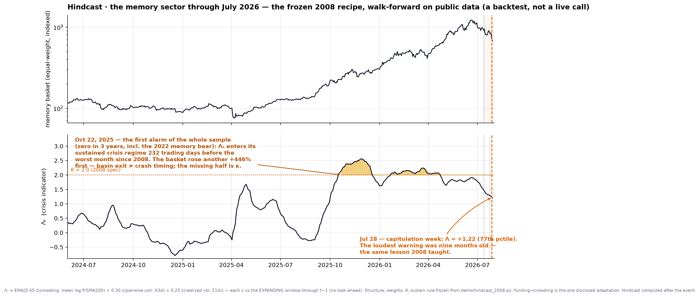

<div align="center">

# MicroWorld
# 월드 모델 × 퀀트 금융

*금융 시장을 위해 설계된 최초의 월드 모델 아키텍처*
*전통적 팩터 마이닝을 넘어서는 퀀트 금융의 새로운 패러다임*

**[English](../../README.md) | [中文文档](../../README_CN.md) | [日本語](README_JA.md) | [한국어](README_KO.md)**

**Alpha Flow Research · HongJin HE · HKUST / Stanford IHP · 2026년 7월**

</div>

> 이 문서는 전체 README의 요약 번역본입니다. 수학적 세부 사항, 17일 노트북 시리즈, 전체 실험 계획은 [영어판](../../README.md)을 참조하세요.

---

## MVP — 노이즈를 제거한 시장 가격의 예측

> *가격에서 행동 노이즈를 벗겨내면 남는 것은 균형 — 모든 플레이어가 자신의 전략을 다 낸 뒤 그 자산이 진짜로 갖는 가치. **우리가 예측하는 것은 바로 그 궤적이다.** 내일의 틱이 아니라, 밀리초가 아닌 월 단위로 보유하는 사람을 위한 노이즈 제거 가격.*

[](../../demo/denoised_price_2026.py)

**명령어 하나, API 키 불필요:** `python demo/denoised_price_2026.py` — 2026년 7월 메모리 반도체 섹터 폭락(SOX 지수 월간 −19%, 2008년 이후 최악)을 시나리오 원형으로 한 **합성 데이터** 컨셉 데모:

- **파란 선이 프로덕트** — 월드 모델이 풀어내는 균형 트랙 P^eq. **검은 선이 시장** — 균형 + 행동 쐐기(기관의 과밀과 LLM에 동질화된 개인투자자의 추격 매수로 부풀어 오른다)
- **신호** — 괴리도 D_t = P_t/P^eq_t − 1이 임계값을 넘고 *동시에 기관 평균장이 이탈 중* — 는 폭락 가속 **11거래일(약 2주) 전**에 점등. 개인투자자는 저점에서 투매하고, 기관은 같은 저점에서 매수하며, 가격은 노이즈 제거 트랙으로 회귀한다
- **대상:** 중장기 보유자(To-C, 개인투자자). 데이 트레이딩·고빈도 거래는 의도적으로 **비대상** — 그 주파수에서는 행동 노이즈가 지배적이며, 정리 1(쌍대 크라메르-라오 한계)이 데이터량으로는 극복 불가능함을 증명한다. 주~월 스케일에서는 균형 성분이 지배적 — 이 모델은 바로 그곳에서 싸우도록 설계되었다. *(연구 신호이며 투자 자문이 아님. 실데이터 버전은 실험 E7.)*

**실데이터 검증 — 2026년 7월을 실제 가격으로 재현.** 2008년 레시피를 **동결**한 채(가중치·임계값·지속 규칙 불변, 자금 스트레스→과밀 연장 한 곳만 공개된 적응), 메모리 바스켓(SK하이닉스·삼성전자·마이크론·WD·시게이트·샌디스크, 데이터 내장·키 불필요)을 이번 달 폭락까지 워크포워드로 재생: `python demo/hindcast_memory_2026.py`. 결과 — 3년간 오경보 0건, 전체 샘플 최초의 경보는 **2025년 10월 22일**(AI 메모리 광풍 그 자체), **2008년 이후 최악의 달보다 232거래일 앞섰다**. 그리고 정직한 나머지 절반: 경보 후 바스켓은 **+446%** 더 오른 뒤에야 무너졌다. 레짐 불안정 탐지는 폭락 타이밍이 아니다 — *언제* 무너지는가는 **누가 쐐기를 떠받치고 언제 이탈하는가**(κ)가 결정한다. 그것이 바로 위 합성 데모 신호의 후반부이며, 실험 E7의 내용이다. "우리가 예측했다"는 주장은 하지 않는다 — 사후 계산된 힌드캐스트이며, 그림에도 명시되어 있다.

[](../../demo/hindcast_memory_2026.py)

**왜 가능한가? 시장의 모든 기존 방식과의 세 가지 결별 — 이것이 이 MVP의 핵심이자 영혼이다:**

**① 인과 귀속 — 딥러닝·강화학습·팩터 마이닝이 구조적으로 풀 수 없는 문제.** 가격 데이터로 훈련된 모델은 의사결정의 *잔여물*에서 배우지만, 잔여물은 아무것도 설명하지 못한다. 우리가 모델링하는 것은 **의사결정자 그 자체**: 현실 세계의 데이터로 시장의 실제 플레이어 — 기관·규제자·개인투자자 코호트 — 를 목적함수·제약·정보집합을 가진 agent로서 완전연결 네트워크 위에서 게임하게 한다. 오늘은 다체·다차원 위계적 평균장 시스템으로의 단순화 형태(1단계), 단순화하지 않은 완전 형태 — **각 agent가 그 자체로 신경망이며 공동 훈련** — 는 [NNGS](../PHASE2_NEURAL_GAME.md)에 명세화되어 하드웨어를 기다린다(H200 200장을 가진 랩이면 닿는다 — 문은 열려 있다). 어느 형태든 출력은 같은 방식으로 분해된다: 어느 주체, 어느 제약, 어느 결합. **인과 귀속은 여기서 네이티브이며, 사후 보정이 아니다.**

**② 정보 격차가 예측의 엔진이다.** 가격이 움직이는 것은 서로 다른 정보를 가진 플레이어들이 서로 다른 시점에 행동하기 때문이다. 이 프레임워크는 시장의 계층화된 정보 구조를 명시적으로 모델링한다: 각 주체 유형은 자신의 정보 흐름만 볼 수 있고, 모델은 "그것만 보이는 상태에서의 합리적 행동"을 유형별로 추정한다 — 가격 변화는 테이프에 집계되기 전, **플레이어 사이의 정보 격차 속에서** 선취된다. 2026년 7월이 이 메커니즘의 실제 사례: 공급망 조사가 기관에 도달한 것은 헤드라인이 개인투자자에게 도달하기 몇 달 전이었다.

**③ 이것은 또 하나의 "금융 에이전트" 프로덕트가 아니다.** 현재의 LLM 금융 에이전트 물결은 리서치 부서의 롤플레이다 — "매니저", "애널리스트", "리스크 담당"이 같은 공개 헤드라인을 놓고 회의한다. 롤플레이는 정보를 만들어내지 못한다: 개인투자자는 여전히 정제된 고신호대잡음비 데이터를 받지 못하며, 같은 프롬프트를 돌리는 사용자가 늘어날수록 남아 있던 우위는 모든 팩터와 같은 속도로 소멸한다. 우리의 agent는 배역이 아니라 **시장의 실제 플레이어 유형의 구조 모델**이며, 사용자가 받는 것은 고신호대잡음비 성과물 그 자체 — 노이즈 제거 균형 가격이다.

## 프로젝트 이야기

왜 모든 트레이딩 모델은 실전 투입 순간부터 죽기 시작하는가? 답은 더 좋은 데이터도, 더 큰 네트워크도 아니다. **시장은 데이터셋이 아니라 게임이다.** 패턴을 예측하면 패턴은 사라진다. 모델링할 수 있는 유일한 대상은 플레이어 자신이다.

MicroWorld는 미국 주식 시장을 **4계층 위계적 평균장 게임(mean-field game)**으로 모델링하는 최초의 오픈소스 월드 모델 아키텍처:

- **Level 0** — 시장 간 자본 흐름
- **Level 1** — 기관 유형 간 경쟁 (중앙은행 · 은행 · 퀀트 펀드 · 개인투자자)
- **Level 2** — 유형 내 개별 기관
- **Level 3** — 기관 내부의 데스크와 개인

7개 정리 증명 완료. 50개 테스트 통과. 모든 데모는 API 키 없이 노트북에서 실행.

## 제1원리의 베팅 — 상관이 아닌 인과

주류 퀀트 방법론 — 팩터 마이닝, 시계열 ML, 피처 엔지니어링 — 은 모두 "**역사의 데이터는 반복된다**"는 검증되지 않은 전제 위에 서 있다. 반복되지 않는다. 발견된 패턴은 발견되었기 때문에 사라진다(루카스 비판).

정말로 반복되는 것은 데이터가 아니라 **데이터를 생성하는 세계** — 권한을 가진 기관, 규칙을 가진 규제자, 신호가 공개되어도 변하지 않는 인센티브 구조다. 그래서 이 프로젝트는 데이터의 잔여물이 아니라 생성기 자체를 모델링한다:

> **우리는 데이터에서 구조를 발견한 것이 아니다. 데이터를 만들어내는 구조를 모델링했다.**

두 가지 결론: (1) 모든 출력은 이름을 가진 주체·제약·균형 조건으로 귀속 가능 — 설명가능성은 부가 기능이 아니라 추론의 방향 그 자체. (2) 균형인 예측은 실행되어도 증발하지 않는다 — 실행되는 것이야말로 균형이 스스로를 실현하는 방식이다.

## 하나의 엔진, 두 개의 프로덕트

### To-C · 노이즈 제거 균형 가격 (중장기 보유용)

문서 첫머리의 MVP 그 자체. 정리 1: 행동 노이즈 ν_η는 누구도 거래로 이길 수 없다. 장기 투자자에게 정말 필요한 것은 노이즈 아래의 **균형 트랙 P^eq**과 괴리도 **D_t = P_t/P^eq_t − 1** — "당신이 사는 것은 가치인가, 과밀인가?" 실데이터 검증은 실험 E7.

> *연구 신호이며 투자 자문이 아닙니다.*

### To-B · 기관용 구조적 리스크

Λₜ 레짐 모니터링, 포지션별 과밀도 분해, 이벤트 연산자 시나리오 분석. Airflow + Alpaca 파이프라인 스캐폴딩 완료.

**실적 — 2008년, 미래 참조 없는 완전 리플레이:** 공개 데이터만으로, 위기 지표 Λₜ는 **리먼 파산 272거래일 전**에 지속적 위기 레짐에 진입했다(2005–2006년 오경보 0건, 신호부터 2009년 3월 저점까지 시장은 −49%).

[](../../demo/hindcast_2008.py)

## 로드맵 — 1단계와 2단계

**1단계 (현재)**: 게임이론 코어. HJB–FPK 연립계, 22개 이벤트 연산자, NeurIPS 워크숍용 실험 E1–E7. 데이터가 희소한 시대의 이론적으로 올바른 선택 — 정리 1은 잔차의 일부가 메커니즘으로*만* 설명될 수 있음을 증명한다.

**2단계: [신경망 게임 구조(NNGS)](../PHASE2_NEURAL_GAME.md)** — **각 뉴런 자체가 작은 신경망**(기관·개인투자자 코호트당 하나)이며, 규제 현실이 아키텍처로 부과되고, 순전파 자체가 게임의 플레이다. 훈련 난도는 대략 제곱으로 증가하므로 H200급 컴퓨팅을 기다린다 — 설계 문서는 지금 공개한다.

## 퀵 스타트

```bash
git clone https://github.com/hongjin-he/MicroWorld
cd MicroWorld
pip install -r requirements.txt

python demo/global_demo.py           # 애니메이션 월드 모델 데모 (약 2분, CPU)
python demo/hindcast_2008.py         # 2008 힌드캐스트
python demo/denoised_price_2026.py   # 노이즈 제거 가격 데모 (합성 데이터)
python -m pytest tests/ -v           # 테스트 스위트 (50개)
```

## 링크

- **전체 README**: [English](../../README.md) · [中文](../../README_CN.md)
- **수학 논문** (전체 증명 · 25쪽): [companion paper](https://github.com/hongjin-he/mathmatical-framework-for-world-models-in-quant-finance)
- **개발 여정**: [docs/JOURNEY.md](../JOURNEY.md)
- **파트너십·연락**: [LinkedIn](https://www.linkedin.com/in/hongjinhe-hkust-edu) · [X](https://x.com/Mr_Abstractor) · [GitHub issues](https://github.com/hongjin-he/MicroWorld/issues)

> *컴플라이언스 고지: 이 저장소는 연구 소프트웨어입니다. 어떤 내용도 투자 자문이 아닙니다.*

<div align="center">

**Alpha Flow Research · HKUST · Stanford IHP · 2026년 7월**

*이것은 퀀트 도구가 아니다. 금융 시장을 이해하는 새로운 패러다임이다.*

</div>
